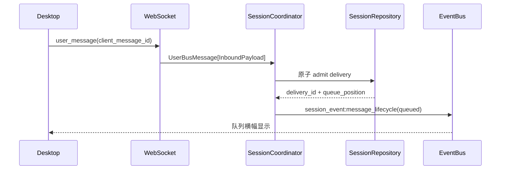
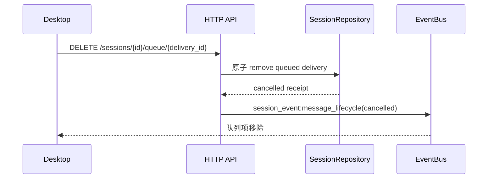

# Typed Bus Message 扁平化改动计划

> 状态：设计计划，暂不执行
>
> 范围：`E:\ftre` 后端、`E:\binn\ftre-desktop` 桌面端
>
> 原则：不新增 `V2`，允许清理旧 session/state 数据后直接切换新协议；本文件不包含代码修改。

## 一、目标

把当前业务代码中的深层嵌套 Bus 字典：

```json
{
  "type": "session_event",
  "data": {
    "type": "message_lifecycle",
    "data": {}
  }
}
```

改成扁平、可校验的消息：

```json
{
  "type": "session_event:message_lifecycle",
  "data": {
    "delivery_id": "delivery_xxx",
    "client_message_id": "client_xxx",
    "revision": 3,
    "status": "failed",
    "queue_position": 0,
    "error": {
      "code": "queue_full",
      "message": "消息队列已满",
      "retryable": true
    }
  }
}
```

核心结果：

- Bus 路由字段与业务 Payload 分离；
- 所有 session 事件由 Pydantic 模型约束；
- Coordinator、WebSocket、Tool 不再手写嵌套字典；
- 桌面端只按 `type` 做一次分发，不再兼容多种嵌套格式；
- queued 消息刷新、取消、重连、失败都能通过 `delivery_id` 正确合并。

## 二、协议设计

### 2.1 Topic 设计

`type` 作为稳定的层级 Topic，不再只表示一级类型：

```text
user_message
agent_event:stream
agent_event:complete
session_event:message_lifecycle
session_event:session_state
session_event:context_warning
global_event:session_status
```

后端不应在各处手写字符串，统一使用 `StrEnum` 或 `Literal`：

```python
class BusTopic(StrEnum):
    SESSION_MESSAGE_LIFECYCLE = "session_event:message_lifecycle"
    SESSION_STATE = "session_event:session_state"
    SESSION_CONTEXT_WARNING = "session_event:context_warning"
    GLOBAL_SESSION_STATUS = "global_event:session_status"
```

EventBus 如果需要按大类订阅，提供 `topic_group` 或统一的 Topic 前缀解析，禁止业务模块自己 `split(":")`。

### 2.2 通用 Bus 信封

`BusMessage` 只负责通用路由和元数据：

```python
PayloadT = TypeVar("PayloadT", bound=BaseModel)


class BusMessage(BaseModel, Generic[PayloadT]):
    id: str
    type: BusTopic | str
    from_channel: str = ""
    from_session: str = ""
    to_channel: str = ""
    to_session: str = ""
    data: PayloadT
    metadata: BusMetadata
    timestamp: float
```

需要保留的字段：

| 字段 | 作用 |
| --- | --- |
| `id` | Bus 帧 ID，不等于 delivery ID |
| `type` | Topic，决定消息分发器和 Payload 类型 |
| `from_channel` / `to_channel` | 通道路由 |
| `from_session` / `to_session` | session 路由 |
| `metadata` | `frame_id`、`client_message_id`、`delivery_id`、`agent_ref` 等传输元数据 |
| `timestamp` | 服务端生成时间 |
| `data` | 强类型 Pydantic Payload |

`metadata` 应从当前偏向 `InboundMetadata` 的定义抽成通用 `BusMetadata`，避免 outbound 消息继续复用 inbound 类型。

### 2.3 Session 消息子类

不要只创建一个仍然接受 `dict` 的 `SessionBusMessage`，而是让每个 Topic 与 Payload 一一对应：

```python
class SessionMessageLifecycle(BusMessage[MessageLifecyclePayload]):
    type: Literal["session_event:message_lifecycle"] = (
        "session_event:message_lifecycle"
    )


class SessionStateMessage(BusMessage[SessionStatePayload]):
    type: Literal["session_event:session_state"] = "session_event:session_state"
```

这样 Pydantic 能够同时约束：

1. 外层 `type` 是否正确；
2. `data` 是否为正确 Payload 类型；
3. Payload 内部字段是否完整、值域是否正确。

## 三、Payload 模型

### 3.1 消息生命周期

```python
class DeliveryDisplay(BaseModel):
    content: str = ""
    attachments: list[dict[str, Any]] = Field(default_factory=list)
    source: Literal["user", "invoke", "task", "team", "cron"]


class DeliveryError(BaseModel):
    code: str
    message: str
    retryable: bool = False


class MessageLifecyclePayload(BaseModel):
    model_config = ConfigDict(extra="forbid", frozen=True)

    delivery_id: str
    client_message_id: str | None = None
    server_message_id: str | None = None
    turn_id: str | None = None
    revision: NonNegativeInt
    status: Literal[
        "sending",
        "queued",
        "processing",
        "completed",
        "failed",
        "cancelled",
    ]
    queue_position: NonNegativeInt = 0
    display: DeliveryDisplay | None = None
    error: DeliveryError | None = None
```

后续可增加状态一致性校验：

- `failed` 必须有 `error`；
- `queued` 的 `queue_position` 必须大于 0；
- `completed`、`cancelled` 不应再有正的 `queue_position`；
- `revision` 必须严格递增，由服务端生成，客户端只接受不回退的 revision。

### 3.2 Session 状态

```python
class SessionStatePayload(BaseModel):
    session_id: str
    revision: NonNegativeInt
    phase: Literal[
        "idle",
        "queued",
        "running",
        "cancelling",
        "compacting",
        "blocked",
        "closing",
        "closed",
    ]
    active_delivery_id: str | None = None
    active_turn_id: str | None = None
    pending_count: NonNegativeInt = 0
    accepting_messages: bool
    cancelable: bool
    awaiting_confirmation: bool = False
    blocked_reason: str | None = None
```

### 3.3 其他 Payload

| Topic | Payload 主要字段 |
| --- | --- |
| `session_event:context_warning` | `session_id`、`code`、`message`、`severity` |
| `global_event:session_status` | `session_id`、`status`、`reason`、`revision` |
| `user_message` | `content`、`attachments`、`session_id`、`client_message_id` |
| `agent_event:*` | 暂时保留核心库事件模型，不在 Gateway 重复建模全部 Agent 事件 |

协议模型统一使用：

- `extra="forbid"`；
- `frozen=True`；
- `NonNegativeInt`、`StrictBool` 等严格类型；
- `Literal`/`StrEnum` 限制状态和来源；
- 禁止在 session/global 事件中继续使用 `dict[str, Any]`。

## 四、后端改动计划

### 阶段 1：Bus 类型层

涉及文件：

- `E:\ftre\src\ftre\bus\message.py`
- `E:\ftre\src\ftre\bus\protocol.py`
- 新增 `E:\ftre\src\ftre\bus\payloads.py`
- 新增 `E:\ftre\src\ftre\bus\publisher.py`
- `E:\ftre\src\ftre\bus\__init__.py`

工作内容：

1. 将 `BusMessage.data` 从无约束字典改为泛型 Payload；
2. 增加 `BusTopic`；
3. 增加 `BusMetadata`；
4. 增加 Session、Global、User Payload；
5. 增加 `SessionMessageLifecycle`、`SessionStateMessage` 等子类；
6. 增加统一序列化方法：`to_wire()`；
7. 明确 JSON 输出必须使用 `model_dump(mode="json")`。

### 阶段 2：Publisher 层

新增语义化发布接口：

```python
await session_events.publish_queued(...)
await session_events.publish_processing(...)
await session_events.publish_completed(...)
await session_events.publish_failed(...)
await session_events.publish_cancelled(...)
await session_events.publish_state(...)
```

涉及文件：

- `E:\ftre\src\ftre\agent\session_coordinator.py`
- `E:\ftre\src\ftre\agent\loop.py`
- `E:\ftre\src\ftre\bus\publisher.py`

Coordinator 不再负责拼接 BusMessage，只负责调用 Publisher。

### 阶段 3：生产者替换

逐个替换 raw `BusMessage(...)`：

- `E:\ftre\src\ftre\channel\ws_channel.py`
- `E:\ftre\src\ftre\tools\send_message.py`
- `E:\ftre\src\ftre\tools\task.py`
- `E:\ftre\src\ftre\tools\team.py`
- `E:\ftre\src\ftre\tools\cron.py`
- `E:\ftre\src\ftre\agent\turn_executor.py`
- `E:\ftre\src\ftre\mcp\adapter.py`

规则：

- 外部输入进入系统时立即 Pydantic 解析；
- 内部模块之间只传 Pydantic BusMessage；
- 不允许业务代码通过 `data["xxx"]` 读取 session 事件；
- Agent Core 的复杂事件保留 Core Event 类型，不在 Gateway 重复定义。

### 阶段 4：EventBus

涉及文件：

- `E:\ftre\src\ftre\bus\bus.py`

改动重点：

1. `publish_inbound`、`publish_outbound` 接受 `BusMessage[Any]`；
2. Bus 不重新猜测 Payload 类型；
3. JSON/raw dict 只允许在 ingress 边界解析一次；
4. 增加按 Topic 或 Topic 前缀订阅的能力；
5. 发布前拒绝未通过 Pydantic 校验的消息；
6. 记录 invalid message 的日志，不静默丢弃。

### 阶段 5：Session 存储与队列操作

涉及文件：

- `E:\ftre\src\ftre\session\entity\state.py`
- `E:\ftre\src\ftre\session\storage\repository.py`
- `E:\ftre\src\ftre\session\manager.py`
- `E:\ftre\src\ftre\agent\session_coordinator.py`

工作内容：

- `QueuedDelivery`、`DeliveryReceipt` 继续使用 Pydantic；
- Bus Payload 与持久化 Delivery 模型明确区分；
- `delivery_id` 作为唯一关联键；
- queued cancel 必须是原子操作；
- cancel 与 worker claim 并发时只能有一个成功；
- 取消结果必须发布 `session_event:message_lifecycle`，状态为 `cancelled`；
- 不能只删除本地 UI 气泡而不改变后端 receipt。

### 阶段 6：HTTP 接口

当前已有接口：

```http
DELETE /api/sessions/{session_id}/queue/{delivery_id}
```

需要统一成强类型响应：

```json
{
  "status": "cancelled",
  "session_id": "sess_xxx",
  "delivery": {
    "delivery_id": "delivery_xxx",
    "status": "cancelled",
    "revision": 4
  }
}
```

状态约定：

| 情况 | HTTP | 处理 |
| --- | ---: | --- |
| queued 成功删除 | 200 | 返回 cancelled receipt，并广播生命周期事件 |
| delivery 不存在 | 404 或 409 | 由 API 规范统一，不返回模糊字符串 |
| 已被 claim/processing | 409 | 告诉客户端不能取消当前执行 |
| 已经 cancelled | 200 | 幂等返回同一个终态 receipt |
| session 正在关闭 | 409 | 明确返回 session_closing |

涉及文件：

- `E:\ftre\src\ftre\api\routes.py`
- `E:\ftre\src\ftre\session\manager.py`
- `E:\ftre\src\ftre\agent\loop.py`

HTTP 删除成功只是请求结果；客户端最终状态仍以 Bus lifecycle 事件或刷新 snapshot 为准。

### 阶段 7：WebSocket

涉及文件：

- `E:\ftre\src\ftre\channel\ws_channel.py`
- `E:\ftre\src\ftre\agent\loop.py`

工作内容：

1. 入站 `user_message` 使用 `InboundPayload`；
2. 下行使用扁平 Topic；
3. attach snapshot 使用同样的 Payload 模型；
4. `pending_messages` 返回 `MessageLifecyclePayload[]`；
5. snapshot 与实时事件继续使用 `session_revision`；
6. reconnect 时确保 snapshot 先注册、再读取、再发送 live event；
7. 不再兼容旧的 `data.type + data.data` 结构；
8. 发送失败必须返回明确的 `message_lifecycle:failed` 或 admission error。

## 五、桌面端改动计划

### 5.1 WebSocket 类型和解析

涉及文件：

- `E:\binn\ftre-desktop\packages\renderer\src\services\websocket-client.ts`
- `E:\binn\ftre-desktop\packages\renderer\src\types\chat.ts`

将当前嵌套协议解析改为 Topic 分发：

```ts
switch (frame.type) {
  case "session_event:message_lifecycle":
    applyMessageLifecycle(frame.data)
    break
  case "session_event:session_state":
    applySessionState(frame.data)
    break
}
```

TypeScript 类型应与后端 Payload 一一对应：

- `MessageLifecyclePayload`
- `SessionStatePayload`
- `DeliveryError`
- `DeliveryDisplay`
- `PendingMessageSnapshot`

删除旧的多形状兼容分支，避免新协议继续被旧结构污染。

### 5.2 Store 和 reducer

涉及文件：

- `E:\binn\ftre-desktop\packages\renderer\src\stores\chat.ts`
- `E:\binn\ftre-desktop\packages\renderer\src\stores\clientSessionProjection.ts`
- `E:\binn\ftre-desktop\packages\renderer\src\stores\session.ts`

规则：

1. 以 `delivery_id` 为首要合并键；
2. `client_message_id` 是刷新/重连期间的第二合并键；
3. lifecycle `revision` 必须单调递增；
4. 旧事件不能覆盖新状态；
5. queued/processing 不作为正式历史消息重复渲染；
6. completed 后与 UserMessage history 合并为一个气泡；
7. cancelled 的 queued 消息从队列展示中移除，但保留短暂终态提示；
8. refresh 时从 HTTP snapshot 恢复 pending，不依赖内存 outbox。

### 5.3 队列横幅 UI

涉及文件：

- `E:\binn\ftre-desktop\packages\renderer\src\features\chat\QueuedMessagesBanner.tsx`
- `E:\binn\ftre-desktop\packages\renderer\src\features\chat\ChatView.tsx`
- `E:\binn\ftre-desktop\packages\renderer\src\features\chat\ChatInput.tsx`

目标界面：

- queued 消息只显示在输入框上方的队列横幅；
- 横幅与输入框之间保留明确 margin；
- 每条消息显示序号、摘要、状态和取消按钮；
- sending 阶段取消按钮禁用；
- queued 阶段可以取消；
- processing 后不能通过 queued 删除接口取消；
- compacting 时禁止提交新消息，但保留输入草稿；
- running 时允许继续发送，发送按钮与停止按钮并存；
- HTTP 取消失败时恢复队列项并显示错误，不静默移除。

现有 `QueuedMessagesBanner`、`cancelQueuedMessage` 可以复用，重点是改成扁平 Topic 和严格的终态处理。

### 5.4 发送、重连和临时 session

涉及文件：

- `E:\binn\ftre-desktop\packages\renderer\src\stores\chat.ts`
- `E:\binn\ftre-desktop\packages\renderer\src\services\websocket-client.ts`
- `E:\binn\ftre-desktop\packages\renderer\src\services\api.ts`

必须保持：

- `client_message_id` 在重试中不变；
- WebSocket 未连接时消息进入有上限的 outbox，不静默 `shift()` 丢弃；
- session 尚未创建时 createSession 请求 single-flight；
- attach 时按连接 epoch 重置 revision；
- HTTP history 的 `metadata.client_message_id/delivery_id` 用于合并本地 sending 气泡；
- durable admission 成功后才把 optimistic message 标记为 queued；
- admission 失败时保留草稿并把本地消息标记 failed。

## 六、消息流程

### 6.1 正常排队



### 6.2 取消 queued



## 七、数据清理和切换策略

不增加 `V2`，采用一次性切换：

1. 停止旧 Gateway 和 Desktop；
2. 清理旧 session/state/history；
3. 部署新的 Pydantic Bus 模型；
4. 后端和桌面端同时切换扁平 Topic；
5. 删除旧嵌套协议解析器和兼容分支；
6. 启动后只接受新模型。

需要保留的不是旧历史兼容，而是当前运行期间的可靠性：

- durable inbox；
- inflight 恢复策略；
- delivery receipt；
- `client_message_id` 幂等；
- `session_revision` 和 `delivery revision`。

## 八、测试计划

### 后端单元测试

- Payload 缺字段时校验失败；
- 非法 `status`、负 `queue_position` 被拒绝；
- `failed` 没有 error 时拒绝；
- `SessionMessageLifecycle.model_dump()` 等于目标扁平 JSON；
- EventBus 可以传递所有 BusMessage 子类；
- EventBus 不接受未校验的 raw dict；
- Topic 分发不会把 session event 交给 global handler。

### 后端队列测试

- A 执行时发送 B/C，严格 FIFO；
- A 完成后压缩，再消费 B；
- cancel queued 与 claim 并发只能成功一个；
- cancel 当前执行不删除 pending；
- queue full 返回 failed lifecycle；
- session delete/stop 不会重新启动 worker；
- 重启恢复 queued，inflight 不自动重复执行。

### 桌面端测试

- 扁平 Topic 正确进入对应 reducer；
- lifecycle revision 回退被忽略；
- queued 消息只出现在横幅，不重复出现在正文；
- refresh 后 queued 消息仍存在；
- HTTP 取消成功后横幅移除；
- HTTP 取消竞态失败后横幅恢复；
- lifecycle 与 history metadata 正确合并；
- WebSocket 断线期间不丢出站消息；
- session 创建 single-flight；
- compacting 时草稿不丢失。

### 端到端验收

1. 发送一条消息，立即刷新 session；
2. 消息正在执行时连续发送两条；
3. 查看横幅中两条 queued 消息；
4. 刷新页面，队列数量和文本不变；
5. 取消第二条 queued 消息；
6. 确认第二条从横幅消失并收到 cancelled receipt；
7. 第一条完成后确认正文只有一个 UserMessage；
8. 检查后端日志没有 raw nested Bus dictionary。

## 九、实施顺序和完成标准

推荐顺序：

1. 定义 Topic、Metadata、Payload Pydantic 模型；
2. 改造 `BusMessage` 泛型和序列化；
3. 增加 Publisher；
4. 替换 Coordinator、Loop、WS、Tools 的生产代码；
5. 切换 HTTP response model；
6. 切换 Desktop WebSocket parser 和 TypeScript types；
7. 切换 Store/reducer；
8. 调整 Queue Banner 和 ChatInput；
9. 清理旧协议、旧历史和旧兼容分支；
10. 执行后端、前端、端到端测试。

完成标准：

- 业务代码不再出现 `data={"type": ..., "data": ...}`；
- `session_event:*` 全部由 Pydantic Payload 产生；
- queued 消息刷新不丢失、不重复；
- queued cancel 有原子后端结果和客户端终态；
- WebSocket、HTTP、历史消息使用同一组 delivery/client ID；
- 后端与桌面端不再保留旧嵌套协议兼容分支；
- 所有改动未生成 `V2` 协议，也不需要历史数据迁移。
