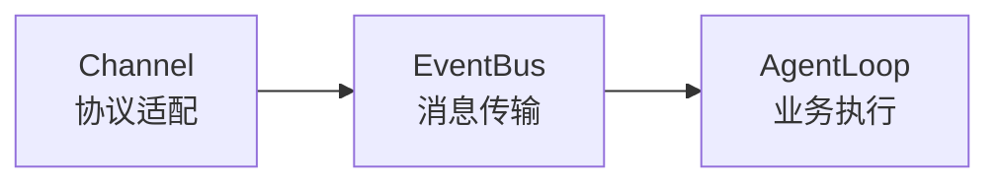
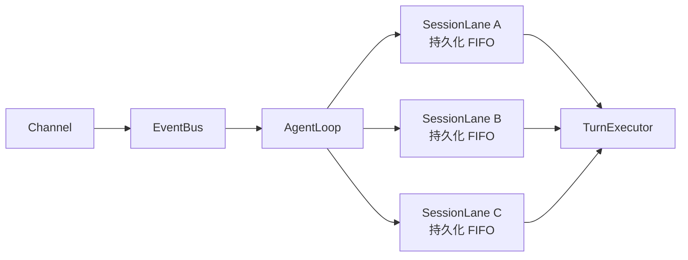
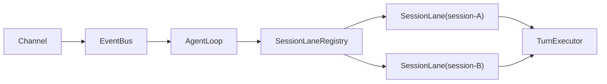
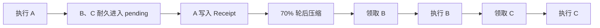
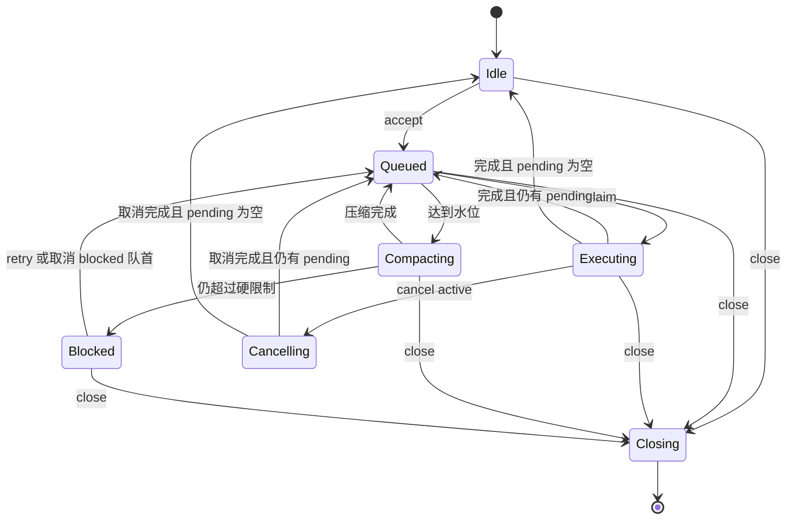
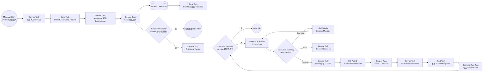

# AgentLoop SessionLane 消息队列架构设计

> 状态：架构设计，待评审后实施
>
> 后端范围：`E:\ftre\src\ftre\`
>
> 客户端范围：本文只定义协议边界；Desktop 改动等待单独通知后实施
>
> 数据策略：不增加 V2 兼容层，允许清理旧 Session 数据后直接切换最终模型

## 一、结论

FTRE 现有主干保持不变：



消息队列不是第四套顶层架构，而是 `AgentLoop` 内部的一种执行策略：

> 把 AgentLoop 原来的“每条消息启动一个独立 Task，再依赖 Session Lock 串行”改成“每个 Session 对应一条持久化 SessionLane”。

最终结构：



设计原则：

1. Channel 只负责协议适配，不理解队列、压缩和 Agent 状态；
2. EventBus 只负责消息传输和请求响应关联，不负责业务持久化；
3. AgentLoop 是唯一应用层入口；
4. SessionLane 是 AgentLoop 内部的 keyed serial executor；
5. Mailbox 是队列的唯一持久化事实源；
6. TurnExecutor 只执行一条已经领取的消息；
7. 消息状态由它在 Mailbox 中的位置决定，不重复保存可冲突的状态；
8. 业务完成先落盘并唤醒等待者，再发布客户端事件。

## 二、设计目标

### 2.1 必须满足

- 同一个 Session 任意时刻最多执行一个 Turn；
- 不同 Session 可以并发执行；
- 当前 Turn 运行时，新消息可以可靠进入该 Session 的持久化队列；
- 消息落盘成功以后，发送方才能收到 Accepted；
- 排队消息不会提前进入 `messages[]` 或当前 LLM 上下文；
- Turn 结束后先完成 70% 轮后压缩，再消费下一条消息；
- 领取消息前执行包含下一条消息成本的 80% 强制水位判断；
- 取消当前 Turn 默认保留 pending FIFO；
- 可以单独取消尚未领取的排队消息；
- Session 刷新后可以恢复 active、pending 和最近终态；
- Gateway 重启时保留 pending，旧 inflight 记为 interrupted，不自动重放工具副作用；
- Session 只有在 active、compact、pending 全空时才是 idle；
- Channel、send_message、task、team 最终使用相同的 AgentLoop 接纳语义。

### 2.2 不做的事情

- 不引入独立 BPMN 引擎；
- 不把 SessionLane 提升成 Channel 可以直接访问的公共服务；
- 不承诺任意外部工具副作用 exactly-once；
- 不通过旧协议兼容层维护历史 Session；
- 不让客户端自己拼接多个不完整的服务端状态事实源。

## 阅读提示：如何理解 SessionLane

SessionLane 可以理解为：

> AgentLoop 内部为每个 Session 建立的一条独立执行车道。消息可以不断进入车道，但同一条车道一次只放行一个 Turn。

它不是新的顶层服务，也不是操作系统线程或独立进程，而是 AgentLoop 内部的一个普通 Python 对象和一个受控的 `asyncio.Task`。



AgentLoop 收到消息后只需要定位车道：

```python
session_id = message.session_id
lane = self._lanes.get_or_create(session_id)
result = await lane.accept(message)
```

接下来这个 Session 的排队、压缩、执行、取消和收尾，都在该 Lane 的边界内完成。

### 接纳和执行是两条路径

SessionLane 最重要的设计不是“加一个队列”，而是把短操作和长操作分开：

```text
accept()
    短操作
    负责幂等检查、消息落盘和确保 Worker 存在

run()
    长操作
    负责压缩门控、领取队首、执行 Turn 和写终态
```

当 A 正在执行时，B、C 不能等 A 完成以后才接纳。`accept()` 必须可以快速把它们写入 pending，然后立即返回 durable Accepted；Lane Worker 执行 A 时不能一直持有接纳锁。

```python
async def accept(self, message: BusMessage) -> AdmissionResult:
    result = await self._mailbox.accept(message)
    if result.accepted:
        await self._ensure_worker()
        await self._publish_snapshot()
    return result
```

Worker 则只负责按顺序放行：

```python
async def run(self) -> None:
    while True:
        item = await self._mailbox.peek()
        if item is None:
            return

        decision = await self._context_gate.before_claim(item)
        if decision.should_compact:
            await self._run_compaction(decision)
            continue
        if decision.blocked:
            await self._enter_blocked(item, decision)
            return

        active = await self._mailbox.claim(item.request_id)
        outcome = await self._turn_executor.execute(active)
        receipt = await self._mailbox.finish(active.request_id, outcome)

        self._completion.resolve(receipt)
        await self._publish_snapshot()
        await self._context_gate.after_turn()
```

### A、B、C 的实际过程

假设 A 正在执行，随后用户或其他 Agent 发送 B、C：

```text
pending = [B, C]
active  = A
```

A 完成并写入 Receipt：

```text
pending  = [B, C]
active   = None
receipts = [A completed]
```

如果达到 70% 水位，Lane 先等待轮后压缩：

```text
operation = CompactOperation
pending   = [B, C]
active    = None
```

压缩完成后才领取 B：

```text
pending = [C]
active  = B
```



因此：

- A 看不到仍在 pending 的 B、C；
- B 被执行时看不到仍在 pending 的 C；
- 压缩只处理已经进入正式历史的内容；
- 排队消息不会因为客户端刷新或 Gateway 短暂重启而消失。

### 为什么不是 asyncio.Queue

`asyncio.Queue` 只能表示当前 Python 进程里的等待项：

```text
Gateway 崩溃
→ asyncio.Queue 消失
→ 客户端已经显示发送成功的消息丢失
```

SessionLane 的队列事实来自持久化 Mailbox：

```text
pending   尚未领取
active    当前唯一正在执行
receipts  最近终态和幂等凭据
```

`asyncio.Task` 只负责驱动 Mailbox，不是队列事实源。

### 一个 Session 只能有一个 Worker

```python
async def _ensure_worker(self) -> None:
    async with self._lifecycle_lock:
        if self._worker_task and not self._worker_task.done():
            return

        self._worker_task = asyncio.create_task(self.run())
```

“检查 Worker、创建 Task、保存 Task 引用”必须在同一个短临界区内完成。但执行完整 Turn 时不能持有这个锁，否则 A 运行期间 B、C 无法被接纳。

### 状态由事实推导

Lane 不允许外部代码到处执行：

```python
runtime.activity = "running"
runtime.activity = "compacting"
runtime.activity = "idle"
```

它根据当前 Operation 和 Mailbox 推导 Session phase：

```python
def phase(runtime: LaneRuntime, mailbox: MailboxState) -> str:
    match runtime.operation:
        case ClosingOperation():
            return "closing"
        case BlockedOperation():
            return "blocked"
        case CompactOperation():
            return "compacting"
        case TurnOperation(cancel_requested=True):
            return "cancelling"
        case TurnOperation():
            return "executing"
        case None if mailbox.pending:
            return "queued"
        case None:
            return "idle"
```

这样不会出现“实际上已经 closing，但 activity 被 cancel 逻辑重新覆盖为 cancelling，客户端却显示还能发送”的矛盾状态。

### 取消只改变自己的目标

取消 active：

```text
校验 expected_request_id
→ 取消当前 Agent/Turn Task
→ active 转 cancelled Receipt
→ pending 完全不变
```

取消 queued：

```text
只从 pending 删除 request_id
→ 写 cancelled Receipt
→ 如果它是 blocked 队首，清除 BlockedOperation
→ 自动重新启动 Worker
```

取消与 Worker claim 同时发生时，由 MailboxStore 原子事务保证只有一方成功，避免同一条消息既被执行又被标记为 queued cancelled。

### SessionLane 的生命周期



这张图描述的是可观察行为；代码不需要另外保存一份可能与事实冲突的 `activity` 字符串。

### 它与当前 Coordinator 的根本区别

当前 Coordinator 同时处理接纳、Worker、压缩算法、Bus Payload、事件发布、等待器、快照、取消、关闭，并读取 AgentLoop 私有字段。

目标 SessionLane 只保留单 Session 编排：

```text
SessionLane
├── 接纳
├── 串行消费
├── Operation 所有权
├── 取消
└── 关闭
```

其他能力通过窄接口提供：

```text
MailboxStore        持久化
ContextGate         水位决策
TurnExecutor        单轮执行
CompletionRegistry  request_id 精确等待
AgentLoop.emit      对外事件
```

所以 SessionLane 的本质不是再增加一个复杂组件，而是：

> 把 AgentLoop 中与单个 Session 有关的状态和执行顺序，收进一条边界明确的持久化执行泳道。

## 三、模块职责

### 3.1 Channel

职责：

- 接收 WebSocket、Octo、Cron、Subagent 等外部输入；
- 校验传输层字段和附件；
- 把输入转换成标准 `BusMessage`；
- 把 outbound `BusMessage` 序列化给外部客户端；
- 对需要耐久确认的请求，等待 EventBus 返回 `AdmissionResult`。

禁止：

- 直接访问 SessionLane；
- 直接访问 SessionRepository；
- 直接判断 Session 是否 running/compacting；
- 直接启动、取消 Turn；
- 直接调用压缩逻辑。

目标上应移除类似下面的反向注入：

```python
ws_channel.set_session_coordinator(...)
```

### 3.2 EventBus

职责：

- inbound/outbound 消息传输；
- `BusMessage.id` 对应的 request/reply correlation；
- middleware 和 Topic 约束；
- Channel 与 AgentLoop 解耦。

EventBus 不保存业务队列。Bus 队列中的消息即使仍是内存数据，也不影响业务可靠性，因为 Accepted 的边界是 AgentLoop 将消息写入 Mailbox。

建议保留两个入口：

```python
await bus.publish_inbound(message)       # fire-and-forget
result = await bus.request_inbound(message)  # 等待 AgentLoop 耐久接纳
```

内部 request/reply Future 不进入 Pydantic `BusMessage`，由 EventBus 维护关联表：

```python
class EventBus:
    _inbound_requests: dict[str, asyncio.Future[AdmissionResult]]
```

### 3.3 AgentLoop

AgentLoop 是唯一应用层门面：

```python
class AgentLoop:
    async def handle(self, message: BusMessage) -> AdmissionResult:
        lane = self._lanes.get_or_create(message.session_id)
        return await lane.accept(message)

    async def cancel_queued(
        self,
        session_id: str,
        request_id: str,
    ) -> Receipt | None:
        lane = self._lanes.get_or_create(session_id)
        return await lane.cancel_queued(request_id)

    def cancel_active(
        self,
        session_id: str,
        expected_request_id: str = "",
    ) -> bool:
        lane = self._lanes.get(session_id)
        return lane.cancel_active(expected_request_id) if lane else False
```

AgentLoop 负责：

- 从 EventBus 消费 inbound；
- 提取 `session_id`；
- 定位 SessionLane；
- 将 `AdmissionResult` 返回给 EventBus；
- 暴露取消、等待、关闭等应用层 API；
- 统一发布 Agent Core Event 和 Mailbox Snapshot。

AgentLoop 不亲自实现 FIFO、压缩算法或单个 Turn 的执行细节。

### 3.4 SessionLane

每个 Session 一个 Lane。不同 Lane 并行，同一 Lane 串行。

职责：

- 耐久接纳消息；
- 确保该 Session 最多一个 Worker；
- 领取队首；
- 编排压缩门控；
- 调用 TurnExecutor；
- 写入 Receipt；
- 取消 queued/active；
- 关闭和恢复；
- 生成当前 Session 的权威 Snapshot。

SessionLane 是 AgentLoop 的内部实现，不作为新的系统顶层入口。

### 3.5 MailboxStore

职责：

- 原子加载、修改、提交一个 Session 的 Mailbox；
- 保证 client message 幂等；
- 保证 FIFO sequence；
- 保证 pending → active → receipt 的原子移动；
- 保证 active 最多一个；
- 对 queued cancel 提供原子 compare-and-remove。

MailboxStore 不发布 Bus 事件，也不启动 Agent。

### 3.6 ContextGate

职责：

- 计算 prompt budget；
- 领取前 80% 水位判断；
- Turn 后 70% 预压缩判断；
- 触发摘要压缩；
- 摘要不足时执行 fast trim；
- 返回 proceed/compact/block 决策。

SessionLane 只执行决策，不包含 token 算法。

### 3.7 TurnExecutor

职责：

- 接收一条已经进入 active 的消息；
- 解析 Agent 配置；
- 构建上下文；
- 写入正式 UserMsg；
- 执行 Command 或 ReActAgent；
- 返回 `TurnOutcome`；
- 保证 finalize 幂等。

TurnExecutor 不负责：

- 找下一条消息；
- 设置 Session idle；
- 自动启动下一轮；
- 操作 pending；
- 决定是否自动压缩。

## 四、最小数据模型

### 4.1 核心思想

消息不保存重复的 lifecycle status，状态由位置决定：

```text
位于 pending[]   → queued
位于 active      → processing
位于 receipts[]  → terminal
```

避免出现下面的矛盾组合：

```text
QueuedMessage(status=running)
Receipt(status=pending)
blocked delivery 已经不在队列但仍显示 queued
```

### 4.2 QueueItem

```python
class QueueItem(BaseModel):
    model_config = ConfigDict(frozen=True, extra="forbid")

    request_id: str
    client_message_id: str
    sequence: int

    content: str
    attachments: list[Attachment] = Field(default_factory=list)

    source: Literal["user", "invoke", "task", "team", "cron"]
    source_channel: str
    source_session: str | None = None
    agent_id: str | None = None

    accepted_at: datetime
```

ID 语义：

| ID | 含义 |
| --- | --- |
| `BusMessage.id` | 一次 Bus 传输帧 |
| `client_message_id` | 发送方重试幂等键 |
| `request_id` | 服务端消息请求 ID，队列/取消/等待的关联键 |
| `user_message_id` | 正式写入 `messages[]` 的 UserMsg ID |
| `turn_id` | Agent 的一次执行 ID |

### 4.3 ActiveItem

```python
class ActiveItem(BaseModel):
    model_config = ConfigDict(extra="forbid")

    item: QueueItem
    turn_id: str
    user_message_id: str | None = None
    started_at: datetime
```

### 4.4 Receipt

```python
class Receipt(BaseModel):
    model_config = ConfigDict(frozen=True, extra="forbid")

    request_id: str
    client_message_id: str
    sequence: int
    outcome: Literal[
        "completed",
        "cancelled",
        "failed",
        "interrupted",
    ]

    turn_id: str | None = None
    user_message_id: str | None = None
    error: MessageError | None = None
    completed_at: datetime
```

`blocked` 不是 Receipt outcome。Blocked 表示 Session 当前无法安全领取队首，队首消息仍然保留在 pending。

### 4.5 MailboxState

```python
class MailboxState(BaseModel):
    model_config = ConfigDict(extra="forbid")

    revision: int = 0
    next_sequence: int = 1

    pending: list[QueueItem] = Field(default_factory=list)
    active: ActiveItem | None = None
    receipts: list[Receipt] = Field(default_factory=list)
```

持久化 Session 文档：

```python
class SessionDocument(BaseModel):
    schema_version: Literal[1] = 1

    session: SessionRecord
    messages: list[Msg]
    mailbox: MailboxState
    metadata: dict[str, Any]
```

不增加 V2；部署时清理旧 Session 后使用最终 schema。

### 4.6 LaneRuntime

异步 Task 不进入持久化模型：

```python
@dataclass
class LaneRuntime:
    worker_task: asyncio.Task | None = None
    operation: Operation | None = None
```

```python
Operation = (
    TurnOperation
    | CompactOperation
    | BlockedOperation
    | ClosingOperation
)
```

Session phase 不再被外部任意赋值，而是根据 operation 和 Mailbox 推导：

```python
def phase(runtime: LaneRuntime, mailbox: MailboxState) -> str:
    match runtime.operation:
        case ClosingOperation():
            return "closing"
        case BlockedOperation():
            return "blocked"
        case CompactOperation():
            return "compacting"
        case TurnOperation(cancel_requested=True):
            return "cancelling"
        case TurnOperation():
            return "executing"
        case None if mailbox.pending:
            return "queued"
        case None:
            return "idle"
```

## 五、可靠接纳与 Bus Request/Reply

### 5.1 为什么不能让 WebSocket 直接调用 SessionLane

直接调用虽然容易拿到 durable ACK，但会破坏：

```text
Channel → EventBus → AgentLoop
```

并让 WebSocketChannel 知道 AgentLoop 内部实现。

### 5.2 EventBus request_inbound

建议在不改变 `BusMessage` 数据模型的前提下，为 EventBus 增加请求响应关联：

```python
async def request_inbound(
    self,
    message: BusMessage,
) -> AdmissionResult:
    future = asyncio.get_running_loop().create_future()
    self._inbound_requests[message.id] = future
    await self._inbound_queue.put(message)
    try:
        return await future
    finally:
        self._inbound_requests.pop(message.id, None)
```

AgentLoop：

```python
async for message in bus.subscribe_inbound():
    try:
        result = await self.handle(message)
    except Exception as exc:
        result = AdmissionRejected.from_exception(message, exc)
    bus.resolve_inbound(message.id, result)
```

这里的 Future 是 EventBus 进程内控制结构，不放进 Pydantic Payload，也不经过 Channel 序列化。

### 5.3 AdmissionResult

```python
class AdmissionAccepted(BaseModel):
    accepted: Literal[True] = True
    request_id: str
    client_message_id: str
    queue_position: int
    created: bool


class AdmissionRejected(BaseModel):
    accepted: Literal[False] = False
    client_message_id: str
    code: str
    message: str
    retryable: bool


AdmissionResult = Annotated[
    AdmissionAccepted | AdmissionRejected,
    Field(discriminator="accepted"),
]
```

语义边界：

- Accepted：QueueItem 已经耐久写入 Mailbox，或命中已有幂等记录；
- Rejected：消息从未进入 Mailbox；
- Receipt.failed：消息已经被接纳，但执行失败；
- Rejected 不伪装成一个持久化失败 Receipt。

## 六、SessionLane 执行流程

### 6.1 接纳

```python
async def accept(self, message: BusMessage) -> AdmissionResult:
    result = await self._mailbox.accept(message)
    if result.accepted:
        self._ensure_worker()
        await self._publish_snapshot()
    return result
```

`MailboxStore.accept()` 在一个 Session 事务中完成：

1. 校验 Session 存在且 Channel 一致；
2. 按 `client_message_id` 检查 pending、active、receipts；
3. 命中则返回原记录，不重复创建；
4. 检查 `len(pending) + int(active is not None)` 是否达到 capacity；
5. 分配 `sequence` 和 `request_id`；
6. append pending；
7. revision + 1；
8. 原子 commit；
9. 返回 Accepted。

### 6.2 Worker

```python
async def run(self) -> None:
    while not self._closed:
        item = await self._mailbox.peek()
        if item is None:
            return

        decision = await self._context_gate.before_claim(item)
        if decision.should_compact:
            await self._run_compaction(decision)
            continue
        if decision.blocked:
            await self._enter_blocked(item, decision)
            return

        active = await self._mailbox.claim(item.request_id)
        if active is None:
            continue

        outcome = await self._turn_executor.execute(active)

        # 业务终态先完成，不能依赖 outbound Bus 是否可用。
        receipt = await self._mailbox.finish(active.request_id, outcome)
        self._completion.resolve(receipt)

        await self._publish_snapshot()
        await self._context_gate.after_turn()
```

Worker finally 必须在同一个 Session 互斥边界内重新检查 pending：

```text
pending 非空 → 重新确保 Worker
pending 为空且无 operation → idle
blocked/closing → 不自动启动
```

## 七、压缩流程

### 7.1 领取前门控

```text
used_tokens + next_item_tokens >= compact_threshold（默认 80%）
→ 等待压缩完成
→ 再重新计算
→ 安全后才把队首移入 active
```

排队消息在压缩完成前保持在 pending，因此不会提前进入当前上下文。

### 7.2 轮后门控

```text
Turn Receipt 已经落盘
→ used_tokens >= precompact_threshold（默认 70%）
→ 等待压缩完成
→ 再消费下一条
```

### 7.3 降级

```text
LLM 摘要失败或仍超水位
→ fast trim
→ 重新计算
→ 仍超过硬限制则进入 BlockedOperation
```

Blocked 时：

- 队首仍在 pending；
- 客户端不能提交普通用户消息；
- 内部来源是否仍可排队由 AdmissionPolicy 决定；
- 必须允许取消 blocked 队首或执行高优先级恢复操作；
- 取消 blocked 队首后必须清除 BlockedOperation 并自动重启 Worker。

## 八、取消流程

### 8.1 取消当前 Turn

```text
AgentLoop.cancel_active
→ SessionLane.cancel_active
→ 校验 expected_request_id
→ TurnOperation.cancel_requested = True
→ agent.cancel_nowait()
→ turn_task.cancel()
→ TurnExecutor finalize
→ active 转 cancelled Receipt
→ 保留 pending
→ 执行轮后门控
→ 消费下一条
```

关闭 Session 时不能先设置 closing，再被普通 cancel 逻辑覆盖成 cancelling。关闭使用独立的 `ClosingOperation`，取消 Task 只是关闭步骤，不改变 operation 类型。

### 8.2 取消 queued

```text
HTTP API
→ AgentLoop.cancel_queued
→ SessionLane.cancel_queued
→ MailboxStore 原子删除 pending 项
→ 写 cancelled Receipt
→ 唤醒 request waiter
→ 发布新 Snapshot
```

若取消的是 blocked 队首：

```text
清除 BlockedOperation
→ 自动 ensure_worker
→ 重新检查新的队首
```

取消与 Worker claim 竞态时，MailboxStore 事务保证只能有一方成功：

- cancel 先成功：Worker claim 返回 None；
- claim 先成功：cancel 返回 conflict，调用方改用 cancel_active。

## 九、快照与客户端状态

### 9.1 权威 MailboxSnapshot

建议由 Mailbox + LaneRuntime 生成一个完整 Read Model：

```python
class MailboxSnapshot(BaseModel):
    session_id: str
    revision: int
    phase: Literal[
        "idle",
        "queued",
        "executing",
        "compacting",
        "cancelling",
        "blocked",
        "closing",
    ]

    active: MessageView | None
    pending: list[MessageView]
    recent_receipts: list[ReceiptView]

    capacity: int
    used_slots: int
    client_can_send: bool
    can_cancel_active: bool
    can_retry_blocked: bool
    blocked_reason: str | None = None
```

Topic：

```text
session_event:mailbox_snapshot
```

客户端按 revision 替换 Mailbox Read Model，不需要自己拼接 queued、processing、cancelled、queue reorder 等多个增量事件。

由于队列容量有界（默认 100），Desktop Gateway 使用完整快照换取确定性是合理的。未来确实出现超大队列时，再增加 delta，不提前复杂化。

### 9.2 Refresh / Attach

```text
WebSocket attach
→ 获取 per-session output lock
→ 注册连接
→ 读取 SessionProjection reply snapshot
→ 读取 AgentLoop mailbox snapshot
→ 发送 AttachSnapshot
→ 释放 output lock
→ 接收实时 outbound
```

Channel 可以通过 AgentLoop 已投影到 Bus 的查询/快照接口取得数据，但不直接持有 SessionLane。具体实现可采用 AgentLoop 暴露的窄 `SessionSnapshotProvider`，而不是注入完整 Coordinator。

## 十、BPMN 2.0 流程

### 10.1 Pool 与 Lane

```text
Pool：FTRE Gateway

Lane：Channel
Lane：EventBus
Lane：AgentLoop
Lane：SessionLane
Lane：MailboxStore
Lane：ContextGate / CompactManager
Lane：TurnExecutor
Lane：Outbound Dispatcher
```

### 10.2 端到端主流程



### 10.3 BPMN 元素映射

| 业务概念 | BPMN 2.0 元素 |
| --- | --- |
| Channel 收到消息 | Message Start Event |
| EventBus request/response | Send Task + Message Catch Event |
| SessionLane 接纳 | Service Task |
| Mailbox | Data Store Reference |
| 水位判断 | Business Rule Task |
| proceed/compact/block | Exclusive Gateway |
| CompactManager | Call Activity |
| TurnExecutor | Call Activity |
| Cancel Active | Interrupting Message Boundary Event |
| Cancel Queued | Non-interrupting Event Subprocess |
| Gateway Stop | Terminate End Event / Signal Event |
| Turn 异常 | Error Boundary Event |
| Turn 超时 | Timer Boundary Event |

关联键：

| 消息 | Correlation Key |
| --- | --- |
| Submit | `session_id + client_message_id` |
| Cancel Queued | `session_id + request_id` |
| Cancel Active | `session_id + request_id` |
| Turn Completed | `session_id + request_id + turn_id` |
| Compact Completed | `session_id + operation_id` |
| Close Session | `session_id` |

## 十一、错误与完成顺序

业务终态与客户端通知必须解耦：

```text
TurnOutcome
→ MailboxStore 写 Receipt
→ CompletionRegistry 唤醒 wait(request_id)
→ 生成 Snapshot
→ EventBus publish_outbound
```

禁止使用：

```text
先 publish_outbound
→ 再唤醒业务等待者
```

否则 Bus middleware 或 Channel 故障会让已经持久化完成的 task/team 永久等待。

实时 outbound 可以是 best-effort；attach snapshot 是恢复事实源。Accepted ACK 必须是 durable 的，不能以“已进入 EventBus 内存队列”作为发送成功。

## 十二、关闭与重启

### 12.1 Session 删除

建议由 AgentLoop 应用服务统一编排，SessionManager 不反向依赖 AgentLoop：

```text
API
→ AgentLoop.close_session
→ Lane 进入 ClosingOperation
→ 拒绝新接纳
→ cancel active / compact
→ await worker
→ 终止 waiters
→ SessionRepository.delete
→ 移除 Lane
```

### 12.2 Gateway Stop

```text
停止新 ingress
→ AgentLoop 停止新接纳
→ 所有 Lane 进入 ClosingOperation
→ active 写 interrupted Receipt
→ pending 保留磁盘
→ cancel + await compact/turn/worker
→ 停止 outbound dispatcher 和 Channel
```

如果 ChannelManager 不能拆分 ingress 和 outbound 生命周期，可以先让 AgentLoop 设置 stopping，使所有后续 `request_inbound` 得到明确 Rejected，再关闭 Channel。

### 12.3 Restart

```text
加载 Session Mailbox
→ active 存在则转 interrupted Receipt
→ pending 非空则创建 Lane 并 ensure_worker
→ 发布恢复后的 Snapshot
```

不自动重放 active，避免工具副作用重复。

## 十三、目标代码结构

保持 AgentLoop 是对外模块，不建立新的顶层子系统：

```text
src/ftre/agent/
├── loop.py                  # AgentLoop 门面、Bus 消费与 Lane registry
├── session_lane.py          # 单 Session FIFO 编排
├── mailbox.py               # QueueItem/ActiveItem/Receipt/MailboxState
├── mailbox_store.py         # Mailbox 原子持久化接口
├── context_gate.py          # 70%/80% 压缩决策
├── compact_manager.py       # 压缩执行原语
├── turn_executor.py         # 单 Turn 执行
└── session_projection.py    # Agent Core Event 投影
```

如果继续复用 SessionRepository，`mailbox_store.py` 可以是窄接口或 Adapter，不要求立即建立第二套存储实现。

## 十四、从当前实现迁移

### 阶段 1：收敛数据模型

1. `QueuedDelivery` 改为无 status 的 `QueueItem`；
2. `inflight` 改为 `ActiveItem`；
3. `DeliveryReceipt` 改为 `Receipt`；
4. root 的 inbox/inflight/recent 合并到 `mailbox`；
5. 清理旧 Session 数据，不增加兼容分支。

### 阶段 2：恢复 Channel → Bus → AgentLoop

1. EventBus 增加 `request_inbound/resolve_inbound`；
2. WebSocketChannel 删除对 Coordinator 的直接依赖；
3. send_message invoke、task、team 统一通过 Bus/AgentLoop 入口；
4. Accepted 必须在 Mailbox commit 后 resolve。

### 阶段 3：拆分 SessionLane

1. AgentLoop 维护 `session_id → SessionLane`；
2. 把 Coordinator 的 per-session Worker 逻辑移入 Lane；
3. Lane 只依赖窄接口，不持有整个 AgentLoop；
4. 删除 `_dispatch_tasks` 和 Lane worker 的双重所有权；
5. active agent cancellation 通过 TurnHandle，不读取 AgentLoop 私有字段。

### 阶段 4：拆 ContextGate

1. Coordinator 中 70%/80% 算法移到 ContextGate；
2. Lane 只处理 ContextDecision；
3. 修复 blocked 取消队首后的自动恢复；
4. manual compact/retry 作为高优先级 Lane control，而不是排在 blocked 队首后面。

### 阶段 5：统一完成与快照

1. 以 `request_id` 作为唯一完成等待键；
2. Receipt 落盘后立即唤醒 waiter；
3. 移除旧的 Session 级 AgentEventHub 完成等待；
4. Session 状态从 Operation + Mailbox 推导；
5. 删除外部任意 `set_activity(str)`；
6. 输出完整 MailboxSnapshot。

### 阶段 6：客户端

客户端改动等待单独通知。目标协议行为：

- running 时允许继续发送；
- compacting 时禁止用户发送但保留草稿；
- invoke/task/team 是否允许排队由后端来源策略决定；
- pending 只显示在输入框上方队列横幅；
- refresh/attach 直接用完整 Snapshot 替换本地 Mailbox；
- 正式 UserMsg 通过 `request_id/client_message_id/user_message_id` 合并，不重复显示。

## 十五、不变量

1. 同一 Session 的 active 最多一个；
2. Turn 和 compact 不并发；
3. FIFO 只由 `sequence` 决定；
4. pending 不进入 `messages[]`；
5. Accepted 必须对应已经 commit 的 QueueItem；
6. Rejected 不产生 QueueItem 或 Receipt；
7. active 只能转为一个终态 Receipt；
8. cancel active 不改变 pending；
9. cancel queued 不能取消 active；
10. blocked 队首取消后必须重新驱动 Lane；
11. idle 等价于无 operation、无 active、pending 为空；
12. closing 后不能再接纳新消息；
13. Receipt 落盘不依赖 outbound 发布成功；
14. 每个 request waiter 只由同一个 `request_id` 的 Receipt 唤醒；
15. Gateway 重启不自动重放上次 active。

## 十六、测试矩阵

### Bus 与接纳

- `request_inbound` 在 Mailbox commit 后才返回；
- Channel 断开不会撤销已经 Accepted 的 QueueItem；
- EventBus resolve 不会串到其他 message id；
- 重复 client_message_id 返回同一个 request_id；
- queue full 返回 Rejected，不写 Receipt；
- Channel mismatch/session missing 返回明确 Rejected。

### SessionLane

- A 执行时接纳 B/C，严格 A → B → C；
- B/C 在 pending 时不出现在 messages；
- 不同 Session Lane 并发；
- 同一个 Session 不产生两个 Worker；
- Worker 退出与新接纳并发时不丢 wakeup；
- Turn error/cancel 后继续消费 pending。

### 压缩

- 领取前 80% 先压缩再 claim；
- Turn 后 70% 压缩完成再消费下一条；
- 压缩时新 invoke 可以按策略进入 pending；
- summary 失败后 fast trim；
- 仍超过硬限制进入 blocked；
- cancel blocked 队首后自动处理下一条；
- manual compact/retry 可以越过 blocked 普通队列。

### 取消与完成

- cancel active 保留 pending；
- expected_request_id 不匹配时不误取消；
- cancel queued 与 claim 并发只能成功一个；
- Receipt commit 后，即使 outbound 抛错，wait(request_id) 仍返回；
- wait B 不会被 A 的完成唤醒；
- stop/close 唤醒所有等待者。

### 重启与删除

- 重启恢复 pending；
- active 被记录为 interrupted 且不自动重放；
- delete 与 submit 并发时 closing 栅栏生效；
- delete 等待 Turn、compact、worker 全部退出再删文件；
- Gateway stop 后 Channel 请求得到明确 Rejected。

## 十七、验收标准

- 主链仍然是 `Channel → EventBus → AgentLoop`；
- Channel 不依赖 SessionLane/Coordinator/Repository；
- SessionManager 不反向依赖 AgentLoop；
- AgentLoop 是所有 Session 业务操作的唯一门面；
- 每个 Session 只有一个 Lane Worker；
- 业务代码不再通过多个字符串字段手工维持 Session activity；
- QueueItem 不包含 pending/running 等重复状态；
- Accepted、Receipt、Snapshot 三种语义边界清晰；
- durable completion 不依赖 Bus 发布；
- blocked、cancel、close、restart 均有闭合流程；
- 后端定向、并发和重启测试全部通过；
- 未修改或提交 Desktop 代码，直到收到单独实施通知；
- 全部改动不 commit，等待人工代码检查。
