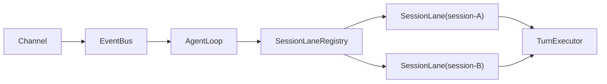
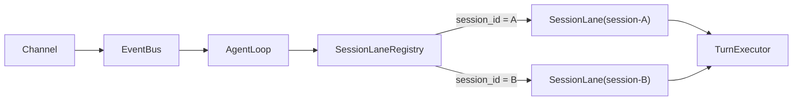
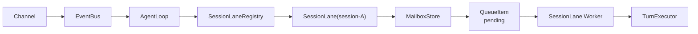
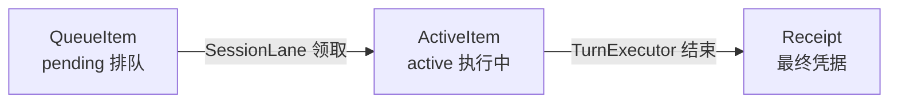
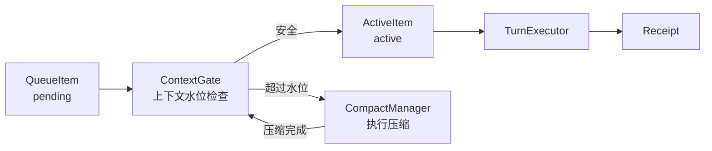
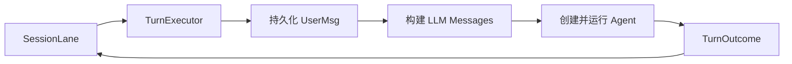
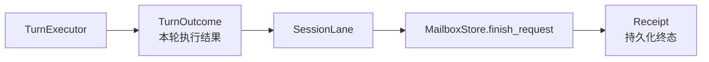
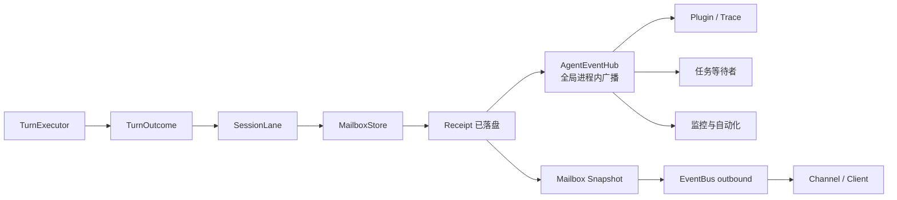
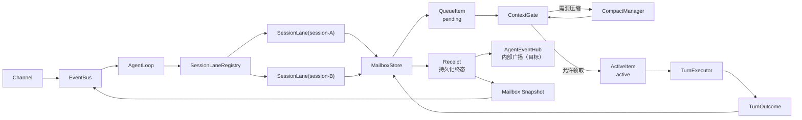

# AgentLoop SessionLane 渐进式理解指南

> 本文是一份阅读辅助材料，用逐层展开的方式解释 `Channel → EventBus → AgentLoop → SessionLane → TurnExecutor`。
>
> 规范性架构设计见：[AgentLoop SessionLane 消息队列架构设计](./2026-08-11-agent-loop-session-lane-design.md)。
>
> 当前状态：SessionLane、Mailbox、ContextGate、TurnExecutor 已实现；文中的全局 `AgentEventHub` 是正在讨论的目标设计，尚未落地。

## 一、从最小骨架开始

先把下面这张图理解成“消息被送到正确的 Session 执行车道”：



三个组件的核心职责是：

```text
SessionLaneRegistry  负责“找车道”
SessionLane          负责“管理这个 Session 的执行顺序”
TurnExecutor         负责“真正执行一轮”
```

## 二、第一层：Registry 如何选择 Lane

增加 `session_id` 路由后：



假设消息按顺序到达：

```text
消息 A1：session-A
消息 B1：session-B
消息 A2：session-A
```

Registry 的路由结果是：

```text
SessionLane(session-A)：A1 → A2
SessionLane(session-B)：B1
```

因此：

```text
A1 与 B1 可以并发执行
A1 与 A2 必须串行执行
```

`SessionLaneRegistry` 本身不执行 Agent，也不保存消息。它主要维护一张运行时索引：

```python
{
    "session-A": SessionLane("session-A"),
    "session-B": SessionLane("session-B"),
}
```

## 三、第二层：在 SessionLane 中加入 Mailbox

消息不能一进入 Lane 就马上执行，需要先可靠入队：



这时 SessionLane 内有两条不同路径。

### 3.1 短路径：消息接纳

```text
SessionLane.submit()
→ MailboxStore 写入 QueueItem
→ state.json 原子落盘
→ 返回 Accepted
```

### 3.2 长路径：后台消费

```text
SessionLane Worker
→ 读取 pending 队首
→ 领取消息
→ 调用 TurnExecutor
→ 等待执行完成
→ 再消费下一条
```

因此 A1 执行时，A2、A3 仍然可以快速入队：

```text
active：A1
pending：[A2, A3]
```

Lane Worker 执行长任务时不会一直占用消息接纳锁。

## 四、第三层：请求在 Mailbox 中的位置变化

Mailbox 中的请求会依次移动位置：



例如：

```text
刚接纳 A2：

pending  = [A2]
active   = null
receipts = []

开始执行 A2：

pending  = []
active   = A2
receipts = []

A2 执行结束：

pending  = []
active   = null
receipts = [A2 completed]
```

待处理消息只存在于 `pending`，此时还没有写入聊天历史，所以不会提前进入 LLM 上下文。

### 4.1 Receipt 是什么

`Receipt` 是一条 `request_id` 已经到达最终状态的持久化凭据，可能表示：

| 场景 | Receipt outcome |
| --- | --- |
| Turn 正常结束 | `completed` |
| 排队消息被取消 | `cancelled` |
| Turn 执行失败 | `failed` |
| Gateway 重启或 Session 关闭时中断 | `interrupted` |

`Receipt` 属于 Mailbox 持久化状态，不属于 EventBus，也不是聊天历史消息。

## 五、第四层：执行前加入 ContextGate

Lane 领取消息之前，还需要检查上下文水位：



ContextGate 只负责做决策：

```text
pass     可以执行
compact  必须先压缩
block    压缩后仍不安全，暂停消费
```

它不会自己领取消息，也不会执行 Agent。

严格顺序是：

```text
pending
→ ContextGate
→ 必要时等待压缩完成
→ active
→ TurnExecutor
```

因此压缩期间，队首消息依然处于 `pending`，不会污染正在被压缩的上下文。

## 六、第五层：TurnExecutor 内部做什么

继续展开 `TurnExecutor`：



`TurnExecutor` 只负责执行一轮：

```text
输入：已经领取的请求
输出：TurnOutcome
```

例如：

```python
TurnOutcome(
    turn_id="turn_123",
    status="completed",
    user_message_id="msg_456",
    final_content="执行结果",
)
```

它不决定下一条消息什么时候执行。收到 `TurnOutcome` 后，控制权回到 `SessionLane`。

## 七、第六层：TurnOutcome 如何成为 Receipt



两者的区别是：

```text
TurnOutcome  TurnExecutor 返回的内存执行结果
Receipt      Mailbox 中持久化的最终凭据
```

只有 Receipt 原子写入成功，才认为这条请求真正结束。

## 八、第七层：加入全局 AgentEventHub（目标设计）

这一层是正在讨论的目标设计，目前尚未写入后端代码：



严格顺序应当是：

```text
TurnExecutor 返回 TurnOutcome
→ SessionLane 写 Receipt
→ AgentEventHub 发布 request.finished
→ 生成 Mailbox Snapshot
→ EventBus 推送客户端
```

其中：

```text
AgentEventHub  给后端内部多个订阅者广播运行时事件
EventBus       在 Channel、AgentLoop 和客户端边界之间传输消息
```

`AgentEventHub` 是实时观察总线，Receipt 才是持久化事实。订阅者错过实时事件后，仍可通过 Mailbox 查询 Receipt。

## 九、最终完整结构

把以上内容合并起来：



一句话总结：

> `AgentLoop` 根据 `session_id` 找到 `SessionLane`；Lane 把请求放进 Mailbox，经过 ContextGate 后交给 TurnExecutor，执行完成后写成 Receipt，再向后端订阅者和客户端发布结果。

## 十、阅读代码的推荐顺序

按照下面的顺序阅读，最容易把模型与代码对应起来：

1. `src/ftre/agent/loop.py`：理解 AgentLoop 如何接收 BusMessage 并定位 Lane；
2. `src/ftre/agent/session_lane.py`：理解单 Session 的接纳、消费、取消和关闭；
3. `src/ftre/session/entity/state.py`：理解 QueueItem、ActiveItem、Receipt 和 MailboxState；
4. `src/ftre/agent/mailbox_store.py`：理解 Lane 如何访问持久化队列；
5. `src/ftre/agent/context_gate.py`：理解压缩水位门；
6. `src/ftre/agent/turn_executor.py`：理解一个 Turn 的执行过程；
7. `src/ftre/agent/compact_manager.py`：理解真正的上下文摘要与快速裁剪；
8. `src/ftre/bus/bus.py`：最后再看 Channel 与 AgentLoop 之间的消息传输。
